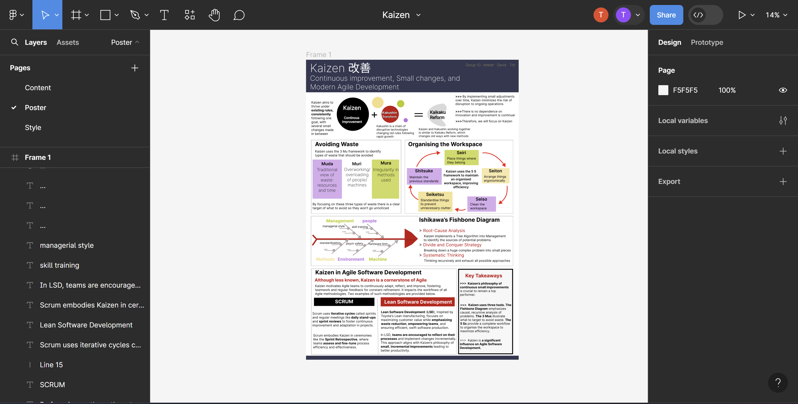

# This repository contains Group 10's Structured Innovation Workshop Poster Coursework

## The work was carried out as part of the Professional Skills Module within the MSc MISCADA programme at Durham University

### Contents

1. E-Poster in .pdf format
2. Images that are used within this README file are stored in the ./images folder. In this poster we did not use external images. Any diagrams that are present were created by our team using shapes in Figma. Nevertheless, some layouts draw inspiration from our research on the topic (e.g. The Ishikawa Fishbone Diagram is commonly shown in the literature in a way similar to ours).

### Project Developement Mentions

Work was carried out using the Figma software, as seen below. In this way, all team members were able to work on the poster at the same time, facilitating collaboration. This was particularily useful during our regular team meetings where we could share ideas and implement them in real time.

